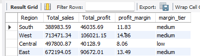

# Superstore Sales Analysis | SQL 📊🛒
This is my **Superstore Sales Analysis** project created using **MySQL**.
The main goal of this project is to explore **retail order-level sales data** and answer common business questions around sales performance, top customers, product trends, and regional profitability.

## 📌 Project Overview
The dataset contains information about retail orders, including:
* Order ID, Order Date, Ship Date
* Customer Name, Segment
* Region, State, City
* Category, Sub-Category, Product Name
* Sales, Quantity, Discount, Profit

## 📊 Analysis Performed
The SQL project answers the following business questions:
* Total sales by product category
* Top 5 customers by total profit
* Products with sales above the overall average
* Monthly sales trends for 2017
* Profit margin by region, bucketed into Low / Medium / High tiers using CASE WHEN

### 🔗 Project Files
**View the full SQL code:**
[superstore_queries.sql](./superstore_queries.sql)

## 🔎 Key Insights

Some of the key observations from the analysis include:
* **Technology** is the top-performing category with **$835,900** in total sales, ahead of Furniture ($733,447) and Office Supplies ($703,503).
* The **West region** is the strongest performer overall — it has both the highest total sales (**$713,471**) and the highest profit margin (**14.36%**), landing in the "Medium" tier.
* The **Central region** is a concern: despite generating **$497,801** in sales, its profit margin is just **8.06%** — the only region in the "Low" tier. This suggests it may be worth investigating discounting practices or cost structure in Central to protect profitability.
* **East** ($672,194 in sales, 13.49% margin) and **South** ($388,984 in sales, 11.83% margin) both land in the "Medium" tier, showing healthy but not standout profitability.
* A small group of top customers contribute a disproportionate share of total profit, based on the top-5 customer profit analysis.

## 🛠️ Tools Used
* **MySQL Workbench**
* SQL (Aggregations, Subqueries, CTEs, CASE WHEN logic)
* Date Functions (STR_TO_DATE, YEAR, MONTH)
* Data Analysis

## 🎯 What I Learned
While working on this project, I learned how to:
* Translate business questions into SQL logic, and solve the same problem using multiple approaches (CTE vs. subquery, LIKE vs. YEAR()) to compare readability and design trade-offs
* Use CASE WHEN to bucket continuous values (profit margin) into meaningful business tiers
* Use subqueries and date conversion functions (STR_TO_DATE) to answer real business questions from raw, unformatted data

## 📁 Files in this Repository
* `superstore_queries.sql` — full SQL code for all 5 business questions
* `README.md` — project documentation

## 🚀 About This Project
This project was built independently using the **Superstore Sales dataset** (Kaggle) as part of my growing Data Analytics portfolio.
I designed and wrote each SQL query myself — breaking down real-world business questions into logic, testing different approaches, and refining my solutions along the way. For Q4 and Q5, I intentionally solved the problem using more than one method (CTE vs. subquery, LIKE vs. YEAR()) to deepen my understanding of query design and demonstrate flexibility in approach.
This project is part of my broader portfolio, which also includes Tableau and Power BI dashboards, as I continue building toward an entry-level Data Analyst / Business Analyst role.

---
**Thanks for checking out my project!** 😊
